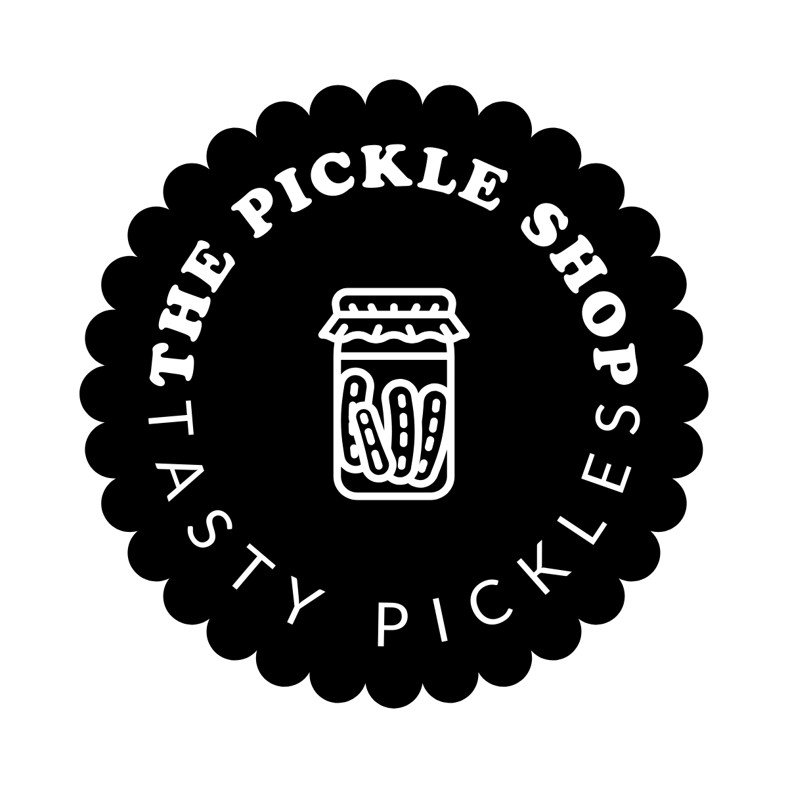

# The Pickle Shop

Welcome to **The Pickle Shop** repository! We specialize in selling a variety of pickles, perfect for sour lovers.



## Table of Contents

- [About](#about)
- [Features](#features)
- [Installation](#installation)
- [Usage](#usage)
- [Contributing](#contributing)
- [License](#license)
- [Contact](#contact)

## About

The Pickle Shop is an online store dedicated to offering a wide range of delicious pickles. Our mission is to bring the best pickles to sour enthusiasts around the world. Whether you prefer classic cucumber pickles or exotic pickled vegetables, we have something for everyone.

## Features

- **Wide Variety of Pickles:** From classic cucumber to exotic vegetables.
- **Easy Online Ordering System:** Simple and user-friendly interface.
- **Fast and Reliable Delivery:** Get your pickles delivered fresh and on time.
- **Secure Payment Options:** Safe and secure checkout process.

## Installation

To run this project locally, follow these steps:

1. Clone the repository:
    ```sh
    git clone https://github.com/SUSH1LPATEL/The-Pickle-Shop.git
    ```
2. Navigate to the project directory:
    ```sh
    cd The-Pickle-Shop
    ```

## Usage

To view the website locally, open `index.html` in your preferred web browser. You can also deploy the site using any web hosting service.

## Contributing

We welcome contributions! To contribute:

1. Fork the repository.
2. Create a new branch (`git checkout -b feature-branch`).
3. Make your changes.
4. Commit your changes (`git commit -m 'Add some feature'`).
5. Push to the branch (`git push origin feature-branch`).
6. Open a pull request.

Please ensure your code adheres to our coding conventions and includes relevant tests.

## License

This project is licensed under the MIT License. See the [LICENSE](LICENSE) file for details.

## Contact

For any inquiries or feedback, please reach out to us at:

- Email: [contact@pickleshop.com](mailto:contact@pickleshop.com)
- Website: [www.pickleshop.com](https://www.pickleshop.com)
- GitHub: [SUSH1LPATEL](https://github.com/SUSH1LPATEL)

---

Thank you for visiting The Pickle Shop repository! We hope you enjoy our pickles as much as we do.
